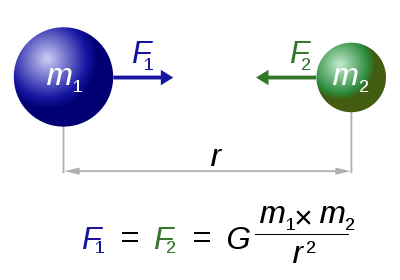

# 物理定律

## 经典力学牛顿三定律
- 1687年英国物理学家艾萨克·牛顿在其《自然哲学的数学原理》书中提出力学三定律。其适用范围是经典力学范围，适用条件是质点、惯性参考系以及宏观、低速运动问题。

### 牛顿第一运动定律【惯性定律】
- 任何物体都要保持匀速直线运动或静止状态，直到外力迫使它改变运动状态为止。
- 牛顿第一运动定律说明：力是改变物体运动状态的原因。

### 牛顿第二运动定律【加速度定律】
- 物体加速度的大小跟作用力成正比，跟物体的质量成反比，且与物体质量的倒数成正比；加速度的方向跟作用力的方向相同。
- 牛顿第二运动定律说明：力的作用效果是力使物体获得加速度。

### 牛顿第三运动定律【作用力与反作用力定律】
- 相互作用的两个物体之间的作用力和反作用力总是大小相等，方向相反，作用在同一条直线上。
- 牛顿第三运动定律说明：力的本质是力是物体间的相互作用。

## 万有引力定律（the law of gravity）
- 自然界中任何两个物体都是相互吸引的，引力的大小跟这两个物体的质量的乘积成正比，跟它们的距离的二次方成反比。【高中物理】
- 万有引力定律是艾萨克·牛顿在1687年于《自然哲学的数学原理》上发表的。
- 任意两个质点有通过连心线方向上的力相互吸引。该引力大小与它们质量的乘积成正比与它们距离的平方成反比，与两物体的化学组成和其间介质种类无关。【普适】

## 热力学三大定律

### 热力学第一定律【能量守恒定律】
- 自然界中的一切物质都具有能量， 能量不可能被创造， 也不可能被消灭； 但能量可以从一种形态转变为另一种形态， 且在能量的转化过程中能量的总量保持不变。
